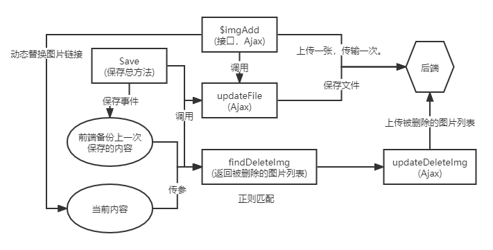

# 右墨文档

# 目录

[目录 [4](#_Toc88175616)](#_Toc88175616)

[1 引言 [5](#引言)](#引言)

[1.1 编写目的 [5](#编写目的)](#编写目的)

[1.2 适用范围 [5](#适用范围)](#适用范围)

[1.3 术语定义 [5](#术语定义)](#术语定义)

[1.4 参考资料 [5](#参考资料)](#参考资料)

[2 概述 [5](#概述)](#概述)

[2.1 系统目标 [5](#系统目标)](#系统目标)

[2.2 需求分析 [6](#需求分析)](#需求分析)

[2.1.1 功能需求 [6](#_Toc88175625)](#_Toc88175625)

[2.1.2 环境需求 [6](#_Toc88175626)](#_Toc88175626)

[3 总体设计 [6](#总体设计)](#总体设计)

[前端： [6](#_Toc88175628)](#_Toc88175628)

[后端： [7](#_Toc88175629)](#_Toc88175629)

[4 概要设计 [10](#概要设计)](#概要设计)

[4.1 功能模块图 [10](#功能模块图)](#功能模块图)

[4.2 各模块的功能说明 [11](#各模块的功能说明)](#各模块的功能说明)

[4.3 数据结构设计 [11](#数据结构设计)](#数据结构设计)

[4.3.1关系结构设计： [11](#_Toc88175634)](#_Toc88175634)

[4.3.2 各个表结构： [11](#_Toc88175635)](#_Toc88175635)

[4.3.3 文件结构（物理结构）设计 [12](#_Toc88175636)](#_Toc88175636)

[4.4 接口设计 [14](#接口设计)](#接口设计)

[4.5 可靠性设计/安全性设计
[14](#可靠性设计安全性设计)](#可靠性设计安全性设计)

[4.5.1 可靠性 [14](#_Toc88175639)](#_Toc88175639)

[4.5.2 安全性 [14](#_Toc88175640)](#_Toc88175640)

[4.6 其他方面的设计考虑 [15](#其他方面的设计考虑)](#其他方面的设计考虑)

[5 详细设计 [15](#详细设计)](#详细设计)

[5.1 游客模块 [15](#游客模块)](#游客模块)

[5.2.1 登录功能设计 [15](#_Toc88175644)](#_Toc88175644)

[前端： [15](#_Toc88175645)](#_Toc88175645)

[后端： [16](#_Toc88175646)](#_Toc88175646)

[5.2.2 注册 [16](#_Toc88175647)](#_Toc88175647)

[前端： [16](#_Toc88175648)](#_Toc88175648)

[后端： [17](#_Toc88175649)](#_Toc88175649)

[5.2 管理员模块 [17](#管理员模块)](#管理员模块)

[前端： [17](#_Toc88175651)](#_Toc88175651)

[后端： [19](#_Toc88175652)](#_Toc88175652)

[5.3 用户模块 [20](#用户模块)](#用户模块)

[5.3.1 文件管理 [20](#_Toc88175654)](#_Toc88175654)

[前端： [20](#_Toc88175655)](#_Toc88175655)

[后端： [22](#_Toc88175656)](#_Toc88175656)

[5.3.2 编辑器 [26](#_Toc88175657)](#_Toc88175657)

[前端： [26](#_Toc88175658)](#_Toc88175658)

[后端： [27](#_Toc88175659)](#_Toc88175659)

[5.3.3．团队管理 [28](#_Toc88175660)](#_Toc88175660)

[前端： [29](#_Toc88175661)](#_Toc88175661)

[后端： [29](#_Toc88175662)](#_Toc88175662)

[5.4 页面设计 [33](#页面设计)](#页面设计)

[5.4.1：前端总体设计思路 [33](#_Toc88175664)](#_Toc88175664)

[5.4.2页面总体设计思路 [34](#_Toc88175665)](#_Toc88175665)

[5.4.3：列表，弹窗组件说明 [34](#_Toc88175666)](#_Toc88175666)

[5.4.4：编辑器说明 [35](#_Toc88175667)](#_Toc88175667)

[6 模块的独立性分析（加分项）
[35](#模块的独立性分析加分项)](#模块的独立性分析加分项)

[6.1前后端分离 [35](#_Toc88175669)](#_Toc88175669)

[6.2前端 [36](#_Toc88175670)](#_Toc88175670)

[6.3后端 [36](#_Toc88175671)](#_Toc88175671)

[7 软件部署与测试 [38](#软件部署与测试)](#软件部署与测试)

[7.1 准备工作 [38](#准备工作)](#准备工作)

[7.2 部署过程说明 [39](#部署过程说明)](#部署过程说明)

[7.3 软件测试方案 [40](#软件测试方案)](#软件测试方案)

[8 遇到的主要问题及解决方案总结
[40](#遇到的主要问题及解决方案总结)](#遇到的主要问题及解决方案总结)

[8.1开发环境部署问题 [40](#_Toc88175677)](#_Toc88175677)

[8.2前后端对接问题 [40](#_Toc88175678)](#_Toc88175678)

[9 小组分工及贡献度 [40](#小组分工及贡献度)](#小组分工及贡献度)

1.  #  引言

    1.  ## 编写目的

互联网已经融入人们的生活，人们学习新知识的方式也多种多样，在线学习也应运而生，譬如各种线上课堂。为了使网络学习的人能更方便的记录笔记，查询笔记，跟随老师的思路，我们设计了这款在线笔记网站，其实也就是云笔记网站。所谓云笔记，就是把个人所写的资料、笔记等存储在运营商的服务器的云端，可以通过手机、电脑同服务器打交道，从而得到自己记录的资料。其优点在于用户可以随时随地记录、分享、收藏笔记。

同时我们的笔记本和团队系统也能让用户编写笔记本的体验更好，能与他人共享自己的笔记，还能为自己的笔记本分类，同时上传图片这样的功能也能实现，未来可能会拓展出更多的在线笔记格式，如word，思维导图等。

## 适用范围

是线笔记的适用范围非常广，有基本计算机操作能力的人群都可以使用我们的在线笔记平台。可以记录简单的文本。目前在线平台主要支持markdown格式，对程序员也非常友好。

## 术语定义

文件/文件夹：指笔记/笔记本

不同模块指的是不同角色能使用的功能。

## 参考资料

1.菜鸟教程 - 学的不仅是技术，更是梦想！.https://www.runoob.com/\[EB/OL\]

2.Vue实现一个MarkDown编辑器 - HelloWorld开发者社区 -
博客园.https://www.cnblogs.com/start1225/p/10887061.html\[EB/OL\]

3\. ThinkPHP6.0完全开发手册.
[https://www.kancloud.cn/manual/thinkphp6_0/1037479\[EB/OL](https://www.kancloud.cn/manual/thinkphp6_0/1037479%5bEB/OL)\]

4\.
vuetify官网.https://vuetifyjs.com/zh-Hans/getting-started/installation/\[EB/OL\]

（访问时间：everyday）

2.  # 概述

    1.  ## 系统目标

本系统旨在打造面向MD文件使用者的在线笔记网站，包括网页前端、后端及数据库。前端做到页面整洁大方、功能正常运行，后端做到能够完全处理前端所提供的数据，并使得网站具有一定程度的安全性考虑。

## 需求分析

[]{#_Toc88175625 .anchor}2.1.1 功能需求

1.用户管理

2.笔记本（文件夹）管理

3.创建、查看、重命名、删除

4.笔记（文件）管理

5.创建、查看、重命名、删除

6.格式：文本，可插入图片，支持Markdown

7.团队协作

8.创建、加入团队

9.在团队内共享笔记

[]{#_Toc88175626 .anchor}2.1.2 环境需求

硬件环境：PC机

软件环境：linux/Windows

# 总体设计

整体采用了前后端分离的思想，前后端只调用接口，后端只返回数据而不渲染页面，这和传统的模板引擎或者高耦合的页面不同，在我们的设计中是前端渲染页面。

[]{#_Toc88175628 .anchor}前端：

{width="5.659722222222222in"
height="4.298611111111111in"}

上图为用户端处理流程图，当用户访问网站时，可以选择图中的路线对网站进行访问，本项目前端旨在让用户完整的完成以上操作流程，提供相应的功能及服务。

[]{#_Toc88175629 .anchor}后端：

{width="5.768055555555556in"
height="6.332638888888889in"}

后端技术栈的选择为ThinkPHP6作为框架，PHP7.3.4作为PHP环境，mysql作为数据库，navicat作为数据库管理，nginx为内置服务器，CentOS作为最终的运行主机。

在数据交互设计上，由于我们用的是前后端分离的架构，所以后端的主要功能就是接收参数，返回数据，查证权限，但不控制视图跳转，这是因为前后端分离的框架中，视图跳转这个功能是前端来实现。

在控制器层的设计上，后端采用两个请求处理层，两个工具类层。请求处理层分别为中间件层和数据交互层，中间件用来查证用户权限，查证用户的请求是否合法，是否越权；数据交互层用来返回数据，返回数据的逻辑，首先是调用工具类层的第一层：输入合法性检查，这层会检查用户输入的字符是否合法，是否符合前端验证的要求；然后开始调用工具类层的第二层：逻辑层，控制层首先接收参数，然后把将参数传给逻辑层处理，逻辑层的函数相互调用，最后返回结果给前端。

在模型层的设计上，后端采用的是think
PHP6自带的Model层，每一个model都是实际数据库上的一个表的映射，每个model类都继承了thinkphp6的基本model类，在操作时，我们对模型进行操作，不需要编写原生的sql语句。

在文件和数据库的设计上，采用的是：文件和文件夹分配真实的硬盘存储，数据库存储真实路径的映射路径，也就是相对路径，这样的设计有一定的安全性和效率性。

4.  # 概要设计

    1.  ## 功能模块图

{width="5.768055555555556in"
height="8.0813812335958in"}

## 各模块的功能说明

总体来讲，本项目功能分为三个模块，即基本功能、普通用户功能和管理功能三模块。

其中基本功能是指用户在未登录之前可以自由使用的游客功能，此功能向访问此网站的所有人开发，不设置阻拦，除了其中的信息卡模块，游客也可以查看标注着游客信息的信息卡；

普通用户功能模块，只有在普通用户完成注册或者登录操作后方可正常使用，其主要功能是实现对文件的管理和编辑；

管理员模块指只有特定的管理员用户不才能访问的模块，其核心功能是对于用户的操作。

## 数据结构设计

[]{#_Toc88175634 .anchor}4.3.1关系结构设计：

{width="5.768055555555556in"
height="3.795138888888889in"}

[]{#_Toc88175635 .anchor}4.3.2 各个表结构：

这里列出了各个表的响应字段和要求，其中user表记录了用户信息，team表记录了团队信息，team_user表记录用户和团队的关系，file_dir表记录了真实文件夹和文件的相应信息，其中包括相对路径，创建者等。

{width="5.768055555555556in"
height="1.8763888888888889in"}

{width="5.768055555555556in"
height="2.2944444444444443in"}

{width="5.768055555555556in"
height="2.0118055555555556in"}

{width="5.768055555555556in"
height="2.160416666666667in"}

[]{#_Toc88175636 .anchor}4.3.3 文件结构（物理结构）设计

我们将用户笔记存以真实的文件，第一层目录叫做CloudsSpace，意为云盘空间，其下是TeamSpace和UserSpace，我们将云盘空间放在和项目根目录同级的目录下，而不是public下，当然不能是public下因为要限制其他人的访问。

{width="5.072282370953631in"
height="5.540974409448819in"}

而我们的图片上传功能上传的图片，是放在public目录下的，这是因为，markdown的图片解析格式是访问这个图片的路径，而用户要想访问到这个路径，就不能用相对路径来存储了，所以我们把图片放在服务区public目录下，就类似于把我们的服务器作为了图床用于存放用户的图片。

## 接口设计

{width="5.9750229658792655in"
height="5.682961504811899in"}

## 可靠性设计/安全性设计

[]{#_Toc88175639 .anchor}4.5.1 可靠性

程序的扩展性能比较优秀，因为网站采用都是真实的文件形式，而非存储在数据库中的longtext，所以后续可以添加任意格式的文件，这极大的增加了可扩展性，同样，我们的网站由于耦合性设计较好，所以增加功能也是比较容易的设计。

[]{#_Toc88175640 .anchor}4.5.2 安全性

由于网站存在上传文件功能，所以一定要队网站上传的文件做过滤，我们采用了两层验证，前端验证和后端文件格式验证，后端的验证分别从文件名，文件后缀和文件的mime类型来查看文件的合法性，同样之后我们会把应用打包为docker上传到服务器上，这样能更加安全的保护我们的服务器。同样我们的服务器对任意命令执行也做了限制，只有一部分文件夹有读写和执行的权限，其余文件夹必须是root账户才有权限来执行和写入。

在站点设计时，我们还加入了防跨站攻击，流量限制，把跨站攻击的目录也做了限制，这样攻击者就无法攻击其他目录。

在用户主页上，我们采取的设计是如果不登陆，是无法跳转到其他页面上的，也不能直接通过url来访问静态网址。

在用户权限设计上，我们采用了session作为用户权限的认证，如果用户的session没有在服务器上有存储，那么说明用户的请求是违法的，我们会在中间件中拦截请求，返回错误信息。

同样的，中间件还会拦截除Post和Ajax之外的所有非法请求头，也是直接返回错误信息。

## 其他方面的设计考虑

在之后的设计中，我们打算把项目部署在docker上，这样更加安全；除此之外，我们打算再给文件验证加一些限制，比如自己再写一个文件验证函数，对上传过来的文件进行双重验证；sql注入方面，我们采用的是框架的model类，采用预编译。

在之后的扩展中，我们可能会加入流程图，实现在线编辑功能，由于markdown的组件是集成的，对它进行socket二次开发有一些难度，所以我们选择完善了网站的其他功能。

# 详细设计

详细设计分为四个部分进行阐述：游客模块、管理员模块、用户模块、用户模块。其中前三个模块对应着功能模块图中的三个功能模块，在这三个模块中，将分为前端、后端两部分对功能的实现方法进行说明，但不介绍前端页面的实现方法，在第四个模块中，我们将单独对前端实现前三个模块UI界面的方法进行论述。

## 游客模块

[]{#_Toc88175644 .anchor}5.2.1 登录功能设计

[]{#_Toc88175645 .anchor}前端：

当用户进入网站后，首先展示的是我们的Home页面，此页面包含了对用户的欢迎信息，网站logo和网站名称等等基本信息。当用户访问到首页时，进入注册、登录页面的方式有两个：点击Home页面的按钮进入登录、注册页面或者点击侧栏进入，

Login页面需要包括对用户名、密码的查验过程：查验包括两步，第一步，对于用户名密码的合法性验证，使用vue输入框提供的rules正则表达式登录；第二步，第二步是与服务器连接，对密码和用户名的匹配进行查验（前后端交互部分可以参见接口设计）。前端Login页面并没有复杂的逻辑，简单的提交表单就可以实现功能。

当用户登陆后，后端会返回用户的具体信息，以判断用户的身份，关于用户身份的部分，将在管理员模块做具体说明

[]{#_Toc88175646 .anchor}后端：

在接收到请求后，首先后端会进行请求判断，除POST请求外的所有请求都会被屏蔽，返回错误信息。经过post过滤后，我们接收用户名和密码，然后查询用户是否存在，密码是否正确，如果正确则登录成功。

登录成功时，我们会给用户返回一个PHPSESSID，同时在后端存储这个session，用于记录用户的登录状态，在此后的所有请求中，我们就会首先判断用户是否登录，如果用户没有登录，则用户发送的所有请求都被视为非法请求，会被驳回。最后返回值和状态，信息错误和成功与否。

[]{#_Toc88175647 .anchor}5.2.2 注册

[]{#_Toc88175648 .anchor}前端：

Login页面需要包括对用户名、密码的查验过程：查验包括两步，第一步，对于用户名密码的合法性验证，使用vue输入框提供的rules正则表达式登录；第二步，第二步是与服务器连接，对密码和用户名的匹配进行查验（前后端交互部分可以参见接口设计）。

Register页面除了对于信息的收集以外，还需要相比Login页面多出一部分对于用户名重复的查验过程，使用ajax可以有效的避免在用户名重复，在此画出用户注册页面核验图。

{width="5.768055555555556in"
height="2.3513888888888888in"}

如图中所示，当用户输入的用户名后，以对输入框失去焦点为事件触发，进行ajax查重，当用户名重复时，前端会自动将用户名输入框清除，但是其他输入框的内容不会被清除，因此用户可以在填写完其他信息时，再重新为自己命名，不必担心页面的全部内容被清空导致重填。

参看接口说明部分，登录页面的核心亮点在于将用户名的查重功能和用户登录信息的提交设为两个不同的接口，这样的异步请求可以很大程度的增添网站的便捷性，方便用户对用户名进行修改

[]{#_Toc88175649 .anchor}后端：

{width="5.367131452318461in"
height="1.200103893263342in"}

在接收到请求后，首先后端会进行请求判断，除POST请求外的所有请求都会被屏蔽，返回错误信息。

过滤了post请求后，我们开始接收表单参数，我们在在数据格式的验证方法中，我们选择了thinkphp6的验证类，采用验证类自带的验证数据格式进行非法数据的过滤和用户名密码的规范，当数据格式正确后。首先我们调用user工具类层的查重方法，检查用户名是否重复，重复则返回，随后我们调用user工具类层的insert方法，这一层再调用model层的方法，使用save（）方法写入数据库。

## 管理员模块

[]{#_Toc88175651 .anchor}前端：

> 要实现对管理员对用户管理方式的设计，首先涉及到的是对于用户这一对象和其属性的设置，经过商讨后，前端设计的用户对象如下：

{width="5.768055555555556in"
height="3.157638888888889in"}

如上图所示，前端对于用户权限的判断主要依靠enabled属性，对其能够使用的功能进行设置，表格中的User类Enabled属性总共有四种，然而，用户实际存在的属性只有三种，即1，2或-1，分别对应着普通用户、管理员用户、不可用用户，而enabled属性为0仅仅用作前端对于状态的标识，用户实体不应存在Enabled属性的值为0的情况。

那么，前端应如何管理用户类的，要构建一个各模块都能使用的用户对象，同时避免在不同组件之间反复传值所带来的耦合，选用Vuex用于管理实体对象，这样一来，只要在Vuex的state中设置与上图中相同的数据结构，并为其设置相应地get和set方法，便实现了用户对象以及其属性的全局管理。

当管理员通过账号登录后，前端实时判断身份后提供进入管理员页面的入口（详见页面设计部分），管理员点击进入用户管理页面。对于用户管理页面的设计，其核心功能有四个：

1.  对用户列表的查询与整体信息展示

2.  新增用户，为其所具有的属性赋值

3.  删除用户

4.  修改用户信息

当前端对这些数据进行处理时，其核心步骤应分为两步，即与后端的数据交互，和前端的数据渲染部分，设置函数结构如下：

{width="5.768055555555556in"
height="2.9618055555555554in"}

其中，通过两个弹窗函数实现对于页面的渲染，在函数结束时，再调用与后端交互的ajax函数，进行数据的传输和获取，最后刷新页面的所有数据，即函数之间按照层次调用：

{width="4.875in" height="1.25in"}

这样的调用方式可延用性强，同时有效的降低了各部分的耦合度，在后续代码编写的步骤中，只需要进一步完善前端的弹窗组件的编写，再对axios函数进行封装，就能够完成网站功能的大致布局。

[]{#_Toc88175652 .anchor}后端：

对于任何管理员页面所发送的请求，我们首先的操作验证就是验证用户是否为管理员，这里我们进行了特判，特判用户传来的sessionid对应的文件中，有没有admin的登录信息，如果有，才进行下面的操作，如果没有则返回错误，这样就避免了如果攻击者绕过前端页面直接发起请求的问题。

由于session是在登录时候给每一位访问者分配了独一无二的值，所以攻击者无法通过修改session内部的值来伪装管理员。

后端的功能相关说明也按照这四点分别展开，以下所写的1、2、3、4分别对应如下的请求。

1.  对用户列表的查询与整体信息展示

2.  新增用户，为其所具有的属性赋值

3.  删除用户

4.  修改用户信息

1.收到前端method参数，接收后，判断为查询请求，则调用工具类中的UserJson函数，返回数据库中所有用户的信息，mk_id,mk_username,mk_password,mk_email,mk_enabled，以json字符串格式返回给前端。

2.判断method参数，判断为createUser，然后直接调用我们写好的user工具类中的insert的方法，与注册的逻辑是一致的，随后返回成功与否。

3\.
判断method参数，判断deleteUser，然后调用我们的UserUtils::delete函数，这个函数的逻辑是首先判断用户是否存在，如果不存在则返回不存在；然后调用model层的删除函数，删除数据库的信息，同时，由于我们的用户有用户空间，所以我们还要删除对应的用户空间下的所有文件，包括数据库中的所有该用户创建的文件信息。删除方法将会在后面的文件管理中介绍，这里放出一张大概的删除流程：

{width="6.140647419072616in"
height="1.7412051618547681in"}

4.判断参数为editUser，然后我们调用我们的工具类中的update参数，同样对用户名字进行检查过滤后，调用model层的insert函数，完成更新，返回成功与否。

## 用户模块

[]{#_Toc88175654 .anchor}5.3.1 文件管理

[]{#_Toc88175655 .anchor}前端：

在对进行文件处理功能模块的设计之前，同上面用户类的说明，需要对于文件对象加以设置。文件类可以方便前端代码管理文件对象，以达到组件间传递对象，而非传值的效果，下图展示对于文件对象属性的设置：

{width="3.28925634295713in"
height="3.300102799650044in"}

其中Value用于动态储存文件当前的内容，达成在编辑器中实时编辑、实时同步的效果；CreaterName用于储存文件创作者的名字，而CreaterType用于储存创作者的类别，如图所示，文件对象的创作者可能是个人，也可能是团队，后者固定的两个储存值标记了文件所属者的同时，前者标记了文件拥有着的名字，方便后端在相应的储存位置找到该文件。FilePath属性用于储存该文件在用户或团队（即Creater）根目录下的相对路径，作为文件查询的凭据。

具体的讲，File类的设计实际就是用与在文件管理组件和文件编辑器之间动态传递文件的各种信息，有效的避免了传递多个单一属性导致的耦合情况，本对象如用户对象一样，也在Vuex中管理。

文件管理组件和编辑器组件是本项目的核心组件，因此其实现方法就非常重要，在进行合理的利弊分析后，前端与后端的文件管理接口最终决定使用分层传递文件目录的的方法，而非树形传递的方法，这是由于树形加载的方法虽然一次传递，一直可用，但是增加了每次刷新初始化时服务器端和客户端的负载，同时其数据结构较为复杂，不利于代码的调试。

下面，给出前端处理逻辑的函数调用流程图：

{width="5.768055555555556in"
height="2.191666666666667in"}

文件处理模块的思路沿用了User管理模块的用户处理思路，采用前端处理事件函数和与后端交互的响应函数分离的思路，在本部分就不再对每一个函数进行赘述。于此同时，为了对树形目录进行处理，还需要添加路径处理模块，其主要的作用就是在前端动态计算当前需要的目录值后，向后端请求当前目录下的文件和文件夹目录。可以看到，前端向用户提供的接口有两个，在当前目录下点击某文件夹可以调用openDir进行路径的前进，在当前目录点击回退按钮，可以退回上一级目录。

同时，再查看目录时，前端同时提供了打开文件的接口，即openFile，当点击此函数时，向服务器返回文件名、用户名、当前路径等信息，从后端获取所查看的文件内容，之后跳转到编辑器界面（参见5.3.2）。

[]{#_Toc88175656 .anchor}后端：

对于笔记的操作，其实他的内核就是文件储存，我们将从8个方面介绍我们的文件管理。

0.实现思路

在浏览了多种笔记文件存储的思路后，所有思路大致分为以下两种：

1\. 用数据库存储文件内容，笔记（文件夹）路径为虚拟路径

2\. 用真实硬盘空间存储文件夹，数据库中存相关文件信息

在比较了两种方法后，最终我选择了第二种处理思路：首先第一种方法的可扩展性很低，只能存储文件内容，这对数据库的性能要求高，而且第一种实现思路就相当于一种云数据库的形式，而我们想要的是一种类似云盘的形式；其次，用数据库存储文件内容，文件的路径就只能是虚拟的，创建文件夹的操作也只是在数据库中插入数据，最后映射到前端，我觉得这是一种缺乏逻辑的想法，虽然它看起来更加单薄轻量，但它的维护就仅仅处在了数据库层面，这样的交互我觉得很单一而且很不符合逻辑。

所以最后我采用了第二种实现思路，我把硬盘空间和数据库进行了连接交互，硬盘空间里储存真实的文件夹、文件，数据库中存映射的路径，而且我把文件和文件夹的信息存放在了一张表里，这张表就映射着所有文件和其路径（相对路径），在前端需要返回某路径下的文件时，我们不需要去真实的文件夹中查找，只需在数据库中返回数据即可，这样提高了不少效率。

file------dir表结构：

    +--------------+---------------------+------+-----+---------+-----------------------------+ 
    | Field        | Type                | Null | Key | Default | Extra                       | 
    +--------------+---------------------+------+-----+---------+-----------------------------+ 
    | dir_id       | int                 | NO   | PRI | NULL    | auto_increment              | 
    | creator_name | varchar(255)        | NO   | MUL | NULL    |                             | 
    | dir_name     | varchar(255)        | NO   |     | NULL    |                             | 
    | path         | varchar(255)        | NO   |     | NULL    |                             | 
    | dir_type     | enum('FILE','DIR')  | NO   |     | NULL    |                             | 
    | creator_type | enum('USER','TEAM') | NO   |     | NULL    |                             | 
    | update_time  | datetime            | YES  |     | NULL    | on update CURRENT_TIMESTAMP | 
    | create_time  | datetime            | YES  |     | NULL    |                             | 
    | cloud_name   | varchar(255)        | NO   |     | NULL    |                             | 
    +--------------+---------------------+------+-----+---------+-----------------------------+

这样做的好处就是，虽然文件和文件夹的操作代码是不同的，但是两个Model可以调用同一个Utils包来进行数据库CRUD，这样其实是一种代码复用，这样的形式也便于管理。

1.文件管理接收请求总览：

{width="6.358884514435696in"
height="2.816910542432196in"}

在文件管理这个地方，也就是对笔记的操作，我们首先进行的就是中间件的过滤，我们首先进行UserSession的过滤，然后进行Request::isPost()\|\|Request::isAjax()的过滤，在这两个请求都过滤成功后，我们才会调用接口控制器进行相关请求的处理，对相关请求参数进行非法检测和过滤。

同时，由于我的文件夹和文件是一张表，所以在数据库层面，文件夹和文件的相关操作是类似的，在之后的说明中可能不会重复说明两中类型操作的区别。

同时，各个接口所接收的参数类似，在此说明文件管理接收的参数：

5个基本参数：

*\$creator_name*` ``=`` request()->param(``'userName'``)`*;创建者*\
`        `*\$dir_name*` ``=`` request()->param(``'fileName'``)`*;文件名*\
`        `*\$dir_type*` ``=`` request()->param(``'fileType'``)`*;文件类型*\
`        `*\$creator_type*` ``=`` request()->param(``'userType'``)`*;创建者类型*\
`        `*\$path*` ``=`` request()->param(``'filePath'``)`*;相对路径*\
基本返回类型：true/false

2.新建文件（夹）：

我们以一个Team新建文件或者文件夹为例，详细说明一下我各个控制器的调用流程和具体的相关操作，在之后的众多功能中，他们的实现逻辑其实与新建是类似的，我们来分析这个过程：

以一个team创建一个文件夹为例：

1\. 判断创建者类型，文件类型：-TEAM - DIR 调用DirUtils-\>createDir()

2\. DirSqlUtils-\>createDir()
判断创建者是否存在-\>判断路径是否为根目录（用于拼接路径）-\>

A.如果为根路径-\>判断文件名是否重复-\>判断文件名是否合法-\>

B.如果非根路径-\>判断文件名是否重复-\>判断路径是否存在-\>判断文件名是否重复-\>判断文件名是否合法-\>

-\>判断用户是否第一次新建文件，如果是，则为其分配云盘空间-\>将此文件夹相关数据存入数据库-\>为用户新建文件夹，调用DirUtils-\>createDir()

3\.
DirUtils-\>createDir()-\>判断文件夹是否已存在-\>为用户创建文件夹，返回true/false

4\. true/false返回DirUtils-\>createDir()，返回DirSqlUtils-\>createDir()
，返回DirController-\>createDir()，最终打包为json响应给前端。

创建文件夹如此，CRUD的调用过程也都类似，其中的逻辑和集成函数比较重要，遵循先数据库再创建文件这样的调用步骤，防止创建恶意文件。

现介绍相关逻辑表达的具体实现，获取路径：getPath，得到前端参数后，用创建者和创建者类型来拼接路径，拼接完成后，查询该路径是否在数据库中已经有重名问题，如果重名则返回false，然后检查文件名字是否合法，这里的检查方法是通过我们自己写的函数来进行检查的，我们用的是similar_text和mb_strlen两个函数来进行判断。如果该路径不是根路径，说明该路径是子目录的内容，这时候我们就需要查找子目录是否存在了，因为根目录是一定存在的，而子目录却不一定，所以我们用isDirExist来查询子目录。

如果用户是第一次新建文件夹，则分配空间给用户，使用的是createDir函数。

以上这些所有的逻辑都是在数据库层面进行的，而不是在真实文件层面进行的，所以说当用户的请求有危险时，首先就会在数据库这一层拦住它，如果它操作不当则会直接返回，即使攻击者绕过了数据库这一层，在我们的真实文件操作层也会做过滤，这样的架构设计能保护我们的安全。

同时，这种以数据库存映射的方式能加快我们的查找效率，在我们返回用户的文件列表时，我们直接在数据库中的相对路径查找即可，而不用去真实的文件结构中查找响应的文件和文件夹。

然后数据库层面的检查逻辑完成后，开始插入这条数据，插入完成后，开始为用户创建文件/文件夹，这时候就进入了DirUtils/FileUtils函数的createDir，在给createDir传递的参数有\$dirname,
\$path，Cretedir接收到参数后，首先对path进行拼接，拼接为真实文件的路径，在拼接真实文件路径时，我们同样采用的是相对路径，这样便于我们跨平台，所以我们的项目根目录才需要和用户磁盘目录在同一级目录下。

然后调用我们的file_exists函数判断文件是否存在，如果存在则返回false，如果不存在，则开始新建文件，这里采用的是mkdir函数，返回这个函数的值。

至此，新建一个文件的过程就结束了，可以看出这个过程其实还是比较复杂和繁琐的，但这样做的意义匹配了我们的数据库存储结构，因为数据库存储结构是需要我们的代码来进行维护的，所以我们的代码的逻辑和完善性一定要好，在接下来的其他功能中，我会主要介绍功能而不介绍逻辑，因为他们的逻辑都是相似的，而且说起来太繁琐。

3.查看文件

功能:返回文件内容

参数:5个基本参数

返回值: false -\>查看失败/json字符串-\>文件(md)内容

*return*` `*F*`ileSqlUtils::getContent(`*\$creator_name*`，`*\$dir_name*`，`*\$dir_type*`，`*\$creator_type*`，`*\$path*`)`*;*

4\. 编辑文件(更新文件)

功能:返回文件内容，文件的最大大小为1M

参数:5个基本参数+newContent(更新的文章内容)

返回值:true/false 表示成功或失败

*\$new_content*` ``=`` request()->param(``'newContent'``)`*;*\
这里我们接收了一个新的参数`'newContent'``,`
代表更新后的文件内容，随后我们现在数据库里查找这个文件是否存在，查找的依据就是我们的五个基本参数，我们的五个基本参数可以锁定一个数据库内的数据，进而完成更新。

我们在文件操作类中，使用最多的是fopen、fwrite、fclose、file_get_contents函数，同时我们对他们的读写进行了限制，比如write函数最多只能写1MB的文件，在更新文件内容中，我们使用的是fwrite函数，赋予它覆盖的权限，他会直接覆盖上次的笔记内容。

5\. 删除文件（夹）

功能:删除文件

参数:5个基本参数

返回值:true/false 表示成功或失败

*return*` `*D*`irSqlUtils::delete(`*\$creator_name*`，`*\$dir_name*`，`*\$dir_type*`，`*\$creator_type*`，`*\$path*`)`*;*\
6. 重命名文件（夹）

功能:重命名文件

参数:5个基本参数+newName

返回值:true/false 表示成功或失败

*if*` (`*\$dir_type*` ``===`` ``'DIR'``)`\
`        `*return*` `*D*`irSqlUtils::``reName``(`*\$creator_name*`，`*\$dir_name*`，`*\$dir_type*`，`*\$creator_type*`，`*\$path*`，`*\$new_name*`)`*;*\
`    `*if*` (`*\$dir_type*` ``===`` ``'FILE'``)`\
`        `*return*` `*D*`irSqlUtils::``reName``(`*\$creator_name*`，`*\$dir_name*`，`*\$dir_type*`，`*\$creator_type*`，`*\$path*`，`*\$new_name*`)`*;*

7\. 返回文件列表

功能:返回文件列表

参数:3个基本参数

返回值:json字符串/false 表示成功或失败

*return*` `*D*`irSqlUtils::getDirsList(`*\$creatorname,*` `*\$creatortype,*` `*\$path*`)`*;*

[]{#_Toc88175657 .anchor}5.3.2 编辑器

[]{#_Toc88175658 .anchor}前端：

前端计划完成的编辑器有MarkDown编辑器和创意编辑器两种，但是创意编辑器并不与后端连接，故不作为功能，只在页面设计部分进行说明，下面对MarkDown格式编辑器进行说明（下文中均简称为编辑器）。

当用户界面由文件管理界面跳转到编辑器时，向Vuex容器中存入了当前打开文件对象的信息：

{width="3.28925634295713in"
height="3.300102799650044in"}

前端通过调用
Vuex中的信息对页面进行渲染，此处不加论述，主要在此部分详细说明文件与文件中图片保存、及图片动态删除的实现方法。

{width="5.767711067366579in"
height="2.928472222222222in"}

如图所示，保存图片和保存文件作为两个接口，由于组件已经提供了封装好的图片上传事件和保存事件（参见页面设计部分），但未提供封装好的删除事件，因此需要在前端手动对被删除的图片列表进行筛选，下面进行详细说明：

当图片被加入到文档，触发图片上传事件，通过\$imgAdd接口触发axios事件，将图片传输至服务器段，由服务器返回图片链接后，动态替换文中的图片链接，上述一切完成后，触发保存事件。

保存函数有三个作用：

1.  备份当前文件内容，留作下一次保存使用

2.  将本次保存的内容以字节流的形式上传到服务器

3.  触发寻找删除图片事件

> 其中，寻找删除图片的函数利用前一次的备份内容，和当前的文件内容进行匹配，利用正则表达式匹配选出文件的图片列表，对上一次的图片列表和本次的内容进行匹配，就可以得到上一次图片列表中存在，而本次不存在的图片，也就是被删除的图片。得到了被删除的图片后，在函数内部判断被删除列表是否为空，若不为空，即有图片相较上次保存时被删除，即触发updateDeleteImg函数，向后端传送删除图片列表。

在上图中的函数中，提供给用户的接口只有save函数，即只有save函数是可以被用户手动触发的，同时，\$imgAdd函数可以被用户进行的上传图片时的动作触发。因此，每当用户保存文件，就可以实现对用户图片删除的检测，达到删除图片的目的。

[]{#_Toc88175659 .anchor}后端：

在编辑器这一模块中，其实调用了文件管理中的查看文件和编辑文件两个接口，这两个接口在上述已经说明，下面主要介绍关于图片的相关设计。

1.上传图片

由于markdown采用的图片解析格式是解析文件的真实地址，而markdown上传时上传的只是文件的内容，也就是纯字符文本，图片并不是嵌在里面的，而是被解析出来的。所以说我们无法通过上传md来保存图片，所以我们增加了新的上传图片接口，这个接口的具体实现是这样的逻辑：

{width="5.916306867891514in"
height="1.282490157480315in"}

首先接收两个参数，分别为文件image和上传者username，接收到图片后，我们首先查验文件的格式是否正确，通过validate类来实现，定义如下规范：

\'fileSize\' =\> 3145728,*//最多上传3M\
* \'fileExt\' =\> \'jpg,png,gif,jpeg\',*//文件扩展名\
* \'fileMime\' =\> \'image/jpeg,image/png,image/gif\',*//mime类型*

分别检测它的后缀名和mime类型，其中mime类型是更有效的判别文件的方式，如果文件不合法，则会抛出错误，并在错误处理中返回错误信息。

然后我们把它放在public目录下，我们的文件名生成格式是md5+时间混合加密所产生的文件名，这样的文件名保证了文件名的唯一性，生成的文件名格式实例如下：

public/FileImage/test5/20211112/24e29c7390350c540753b57d7d73891d.png

其中test5为上传者的名字，后面的数字为日期，最后的文件名为加密后的随机文件名。

这个图片是可以在任何外链访问到的，它的地址是：

<http://lhl2507.cn/FileImage/test5/20211112/24e29c7390350c540753b57d7d73891d.png>

上传到服务器上之后，我们还要生成把这个生成的地址返回给前端，让markdown编辑器渲染这个图片到相应的位置上，同时返回相应的信息。

2.图片删除

其实图片删除的功能并不是必须的，因为每一张图片的文件名都是不同的，所以并不会出现图片访问不到i的情况，但正是因为每一张图片的文件名都不同，导致服务器中有很多相同的图片。所以我们才需要引入删除图片的功能来减少服务器内存的压力，其相关的流程如下：

{width="5.807860892388452in"
height="0.9015813648293963in"}

在我们这次的图片删除中，我们采用了前端获取图片列表的方法，这样做是因为前端本身就有本次笔记的内容，所以他很好和更新的内容做对比，但后端还需要再获取一次文件内容，所以我们用前端来识别图片列表，我们这次采用的是正则表达式匹配的手段来获取更新的图片列表。

后端只接收一个参数，就是获取的文件列表，当我们获取到文件列表时，首先我们要过滤非法路径，因为相对路径是可以通过拼接../这样的字符来达成任意文件删除的，所以我们先过滤文件路径；再用过滤之后的图片列表来删除public目录下的图片文件。

[]{#_Toc88175660 .anchor}5.3.3．团队管理

[]{#_Toc88175661 .anchor}前端：

团队的设计与用户十分相近，只是属性进行了替换，其在管理方法上是完全一致的，相较用户较为复杂的是，团队中只有创始人才具有解散团队的权力，而普通队员只有推出团队的权力，通过下图来标识团队管理功能前端的函数设计：

{width="5.768055555555556in"
height="2.3868055555555556in"}

本图不做过多说明，详见后端部分。

[]{#_Toc88175662 .anchor}后端：

团队管理的实现和用户管理其实是非常相似的，其中也包括了给团队云盘空间，给团队查验身份，查验名称，比user多的方法就是多了一张team---user表来表述他们之间的关系，新增了加入团队和离开团队这样在用户表中没有的功能，下面我们从思路和功能分析这个模块：

0\. 实现思路

1.Team名字命名规则和User一样，所有前端输入框(新增，加入)都要做验证，后端也会做验证.
按理说id也得做验证，或者其实按理讲，所有参数都应该检查合法的问题.

命名规则: 1-20个字符以内，英文数字下划线破折号

2.creator_name表示创建者，username表示用户

3.生成一个随机的团队id，分配给团队，用来唯一标识团队.

id是9位随机大小写字母+数字的组合

4.基本逻辑：

{width="5.8152230971128605in"
height="1.2969630358705162in"}

5.表结构：

Team------user表

\+*\-\-\-\-\-\-\-\-\-\-\-\--+\-\-\-\-\-\-\-\-\-\-\-\-\--+\-\-\-\-\--+\-\-\-\--+\-\-\-\-\-\-\-\--+\-\-\-\-\-\-\-\-\-\-\-\-\-\-\-\-\-\-\-\-\-\-\-\-\-\-\-\--+\
*\| Field \| Type \| Null \| Key \| Default \| Extra \| *\
*+*\-\-\-\-\-\-\-\-\-\-\-\--+\-\-\-\-\-\-\-\-\-\-\-\-\--+\-\-\-\-\--+\-\-\-\--+\-\-\-\-\-\-\-\--+\-\-\-\-\-\-\-\-\-\-\-\-\-\-\-\-\-\-\-\-\-\-\-\-\-\-\-\--+\
*\| id \| int \| NO \| PRI \| NULL \| auto_increment \| *\
*\| username \| varchar(255) \| NO \| \| NULL \| \| *\
*\| team_name \| varchar(255) \| NO \| \| NULL \| \| *\
*\| team_id \| varchar(32) \| YES \| \| NULL \| \| *\
*\| create_time \| datetime \| YES \| \| NULL \| on update
CURRENT_TIMESTAMP \| *\
*+*\-\-\-\-\-\-\-\-\-\-\-\--+\-\-\-\-\-\-\-\-\-\-\-\-\--+\-\-\-\-\--+\-\-\-\--+\-\-\-\-\-\-\-\--+\-\-\-\-\-\-\-\-\-\-\-\-\-\-\-\-\-\-\-\-\-\-\-\-\-\-\-\--+*

Team表

    +--------------+--------------+------+-----+---------+----------------+ 
    | Field        | Type         | Null | Key | Default | Extra          | 
    +--------------+--------------+------+-----+---------+----------------+ 
    | id           | int          | NO   | PRI | NULL    | auto_increment | 
    | team_name    | varchar(255) | NO   |     | NULL    |                | 
    | creator_name | varchar(255) | NO   |     | NULL    |                | 
    | team_cloud   | varchar(255) | YES  |     | NULL    |                | 
    | create_time  | datetime     | NO   |     | NULL    |                | 
    | team_id      | varchar(32)  | YES  |     | NULL    |                | 
    +--------------+--------------+------+-----+---------+----------------+

1.新建团队

功能: 某个用户创建一个团队，同时把他加入到这个团队

参数:(\$team_name，\$creator_name)

返回值:团队ID-\>成功/false-\>团队名字不合法/团队已存在

*return*` `*T*`eamUtils::createTeam(`*\$team_name,\$creator_name*`)`*;*\
这个新增的逻辑和用户的新增基本一致，首先checkDuplicte来查重，然后用validate(TeamNameCheck)来验证团队名字的合法性，然后插入数据库，这里需要同时在team和teamuser表中插入数据。

2.解散团队

功能: 创建者解散这个团队，同时删除团队的文件夹

参数:(\$team_name，\$team_id，\$username)

(这里的username是用户的名字，因为要检验他是不是创建者)

返回值:true-\>成功/false-\>团队不存在/不是创建者

*return*` `*T*`eamUtils::disband(`*\$team_name,\$team_id,\$username*`)`*;*

isband的特殊之处在于，只有创建者可以解散团队，而且它还需在解散时删除对应的用户空间，他的流程如下：

{width="4.957713254593176in"
height="1.6768733595800525in"}

首先检查team是否存在，包括该用户是否有权限解散team，验证通过后，首先删除团队在数据库中的数据，删除完毕后，再去删除对应的文件夹和文件，删除文件夹和文件时也需先删除文件在数据库中的映射数据，然后再删除真实文件列表。

3.加入团队

功能:某用户加入一个团队

参数:(\$team_id，\$username)

返回值:true-\>成功/false-\>加入失败，团队不存在/重复加入

*return*` `*T*`eamUtils::``join``(`*\$team_id,\$username*`)`*;*

4.退出团队

功能:某用户退出一个团队

参数:(\$team_id，\$username)

返回值:true-\>成功/false-\>失败

*return TeamUtils::join(\$team_id,\$username);*

5.返回用户所在团队及团队的所有信息

功能: 返回用户所在的所有团队，及每个团队的信息:

团队的名字，团队ID，创建者 ，创建时间，\[用户名，邮箱\]数组

参数:(\$username)

返回值:数组/false

*return*` `*T*`eamUtils::getAllTeamInfo(`*\$username*`)`*;*\
这个功能的特殊之处在于，它需要调用三个model层，首先获取到username后，同样的检查权限，然后首先去teamuser表中查询，找到这个用户所在的所有团队，得到了一个团队列表，得到团队列表后，用这个团队列表再去teamuser表中查询，找到每个团队中的所有成员，获取这些成员时，我们还需要去相应的user数据库中查询每个用户的名字和邮箱，然后构成一个用户信息表，用户信息表在团队中，所有团队信息再组成一个团队信息列表，再转为json字符串，最后返回给前端，前端统一赋值。下面时一个数组示例：

    [
      {
        "teamName": "team3",
        "team_id": "ao9B5gAGA",
        "creater": "s2yd",
        "createTime": "2021-11-02 13:49:38",
        "members": [
          {
            "username": "s2yd",
            "email": null
          },
          {
            "username": "1111",
            "email": "111@qq.com"
          },
          {
            "username": "test5",
            "email": "testclass@qq.com"
          },
          {
            "username": "Visitor",
            "email": "Visitor@qq.com"
          }
        ]
      },
      {
        "teamName": "team1",
        "team_id": "jXleD3gcx",
        "creater": "s2yd",
        "createTime": "2021-11-02 01:33:24",
        "members": [
          {
            "username": "s2yd",
            "email": null
          },
          {
            "username": "test6",
            "email": "test@qq.com"
          },
          {
            "username": "test6",
            "email": "test@qq.com"
          },
          {
            "username": "1111",
            "email": "111@qq.com"
          },
          {
            "username": "Visitor",
            "email": "Visitor@qq.com"
          }
        ]
      }
    ]

以上就是所有的团队设计模块，同样的，在团队控制器进行任何操作时，都首先经过的是session层的过滤，再经过post请求方法的过滤，防止任意文件删除或者任意用户、团队删除。

## 页面设计

[]{#_Toc88175664 .anchor}5.4.1：前端总体设计思路

前端对于技术栈的挑选为VUE作为核心框架，vuetify辅助开发样式，其中引入的其他组件，将在下面的部分分别论述其必要性及功能。

基本模块的设计首先需要包括对于网页总体的设计概述，前端为了避免大量代码耦合，一页出现上千行代码
，html、js、css大量代码堆积在一个文件中的情况，尝试通过Vuex和vue的组件功能进行简单的解耦，具体思路如下：

前端作为后端数据结构的UI映射，需要设计基本的对象类型，在本项目中，主要的对象类型即用户、文件、文件夹、团队。其中团队是承载用户的容器，文件夹是承载文件的容器，该四个实体类分别在Vuex开辟的store中有相应的映射。

另一方面，前端是基于单页面思路下，用路由替换实现页面跳转的应用，因此前端代码应当以页面为单位，将其中的模块尽量组件化，以达到封装的效果，在浏览前端文件目录时，可以清楚的悉知每一部分的作用。在这样的基础之下，就不需要再对html、js、css进行拆分，以免增添难度，画蛇添足。

[]{#_Toc88175665 .anchor}5.4.2页面总体设计思路

对于页面的布局设计，经过一番尝试思考后，我们最终决定使用较为经典的顶栏、侧栏、底栏设计。其中，顶栏用于控制侧栏的出现与隐藏，同时也包含一些拓展功能小组件；侧栏作为主要的核心功能跳转部分；底栏作为备案后的备用留存区域（未实装，因为网页只有在上线后才能完整在公安备案的审批）。

{width="5.768055555555556in"
height="3.9451388888888888in"}
如上图中展示的网站设计图，除去上述三个导航栏，页面核心部分，即中心部分，使用vue所提供的router替换进行完成，当涉及到页面跳转时，通过动态替换页面中心内容完成。上述对于前端功能的论述也建立于此功能之上。

顶栏需要包括的按钮有：

1.  控制侧栏出现/隐藏的控制按钮

2.  .控制评分卡片出现的按钮

3.  控制跳转到github的链接按钮

侧栏需要包括的按钮有：

4.  注册、登录按钮

5.  游客对应Home按钮

6.  管理员对应用户管理按钮

7.  普通用户对应文件管理按钮、团队管理按钮

与此同时，还需要完成的按钮是打开拓展功能的悬浮按钮，即右侧红色按钮。

[]{#_Toc88175666 .anchor}5.4.3：列表，弹窗组件说明

对于用户列表、文件列表的展示，需要使用前端框架（Vuetify）所提供的V-List组件，参看Vuetify官方文档，将其内容与数据进行动态绑定即可，但是对于添加，删除，修改等事件，需要在页面中添加V-snackbar和V-dialog进行对于事件的响应。

[]{#_Toc88175667 .anchor}5.4.4：编辑器说明

为实现MD文件编辑器，需要使用开源项目Mavon-editor，然后，其虽然简化了我们对于前端的开发过程，然而其有一些特性也是需要修正的，首先是对于其提供的接口的选择性使用（详见5.3.2部分）。

下面对创意编辑器模块进行说明：

创意编辑模块的灵感来自于Typora对于md文件内容的动态替换，在编辑器中我们未实现动态替换，而是调用开源项目，进行了动态翻译，为了探索这种技术，我们在创意编辑器中尝试了解学习动态替换技术。

对创意编辑器的设计模块如下：

{width="4.9375in" height="3.3020833333333335in"}

即对用户输入设置三个监听器，在监听事件发生时，动态替换句首，句尾，和句子中间固定短语，对短语库进行动态替换。

# 模块的独立性分析（加分项）

独立性较强的模块应该是高内聚、低耦合的。请针对所设计开发的软件平台从单个模块的内聚性和模块间的耦合度两个方面进行分析，发现的不足可提出改进的思路。

[]{#_Toc88175669 .anchor}6.1前后端分离

在最初设计网站时，我们就想好了，下定决心一定要做一个前后端分离的网页，因为我们深知前后端不分离的网页的架构是非常耦合且难以维护的，同样也不易于开发。

所以我们采用了接口的设计思想，我们前后端的唯一交互就是接口的调用，前端使用axios发送请求，同时接收后端的数据，拿到数据后利用vue的动态绑定渲染页面，储存数据；后端采用controller和middleware层的配合，中间件拦截过滤请求，控制层接收数据，处理逻辑，返回数据。

这样极大的规范了我们的开发流程和开发难度，改进了传统mvc架构的难点，不需要控制层再进行视图跳转和页面渲染，控制层只需要处理逻辑和验证权限即可；同时，我们在开发过程中也采用了解耦的方式，我们并不是把前端页面放在后端的服务器上进行开发，而是跨域协同开发，因为我们的交互只有接口，所以只要开启了跨域，我们便可以在两台电脑上进行调试，不需要实时整合我们的代码到一个项目中；直到最后部署时，我们的跨域才需要改为同域，此时只需要将vue项目打包，并把它加入到public目录下，然后在主页控制器中加入一个重定向指向到public目录下的index，所有的部署就完成了，网站便可以正常运行了。

我们的前后端耦合度非常低，举一个简单的例子就能很好的感受到，如果前端需要改写样式甚至是网页布局，前端人员只需要在它的开发环境中修改完毕后，直接上传打包后的新网站文件到服务器的运行目录下，覆盖原有的前端页面即可，后端不需要做任何修改，这样的开发方式对前端非常友好，因为它可以在自己的开发环境中调试代码，而不是需要在自己的开发环境中搭建一个后端服务再运行自己的前端代码。因为我们的开发过程是跨域实现，它甚至可以让我们的开发环境不同，例如在本次开发中，前端使用的是linux开发，后端使用windows，但这样的环境交互测试也不会有任何问题。

我们的跨平台性也比较好，当然这也得益于框架和语言的跨平台性，在测试中，我们的服务是在后端windos本机上运行，而当我们把它部署在Ubuntu服务器上时，只需简单的导入便能正常运行我们的服务，无需修改任何代码部分。

[]{#_Toc88175670 .anchor}6.2前端

前端的降耦主要体现在通过vue框架对网页进行组件化处理和通过vuex管理前端数据上，下面对文件管理部分的内聚性和耦合性进行分析：

文件管理模块包括了对文件的增删改查操作，同时其每个操作内部，也将对于UI的处理和对于数据的处理分为两部分，提高内聚。其低耦合表现在，该组件（页面）并不直接向其他页面传值，而是通过对vuex中文件对象的属性的写入达到传值的目的，如果需要增加其他调用文件属性的新页面，就不需要修改file.vue的内容，增加传值接口，而是直接从vuex中调用就可以了，这也体现了低耦合的特点。

[]{#_Toc88175671 .anchor}6.3后端

{width="3.283617672790901in"
height="5.192116141732283in"}

后端采用了标准的mvc架构，只不过现在的view层不由后端来渲染，model层用于持久话数据，和数据库进行交互，这是后端与数据唯一的接口，耦合性低；同时我们自己编写了工具类，也就是utils层，这个层是与model层的唯一接口，耦合性低；然后就是我们的controller层，它接收请求，并调用utils层，它是utils层的唯一接口，耦合性低；最后就是middleware验证器层，它在controller层上面，过滤发给控制器的所有请求，它是controller层的唯一接口；最后就是前端发来的请求，请求首先经过middleware层，middleware层就是和请求的唯一接口，耦合性低，总体而言，请求从middleware------controller------utils------model------database层层过滤，层层传递参数，最后再层层返回，每一层都有它明确的功能，实现了解耦。

# 软件部署与测试

{width="5.474359142607174in"
height="7.526017060367454in"}

## 准备工作

使用宝塔Linux面板，下载LNMP，即nginx，Mysql，PHP。

他们分别的环境配置为：

{width="4.858754374453193in"
height="1.3167804024496939in"}

## 部署过程说明

由于采用的是直接服务器部署的方式，所以部署过程并不太复杂，分为以下几步：

1.新建站点

{width="5.464752843394575in"
height="5.275380577427821in"}

将站点的根目录设置完成后，我们导入我们的项目文件，导入成功后开始导入数据库。

2.导入数据库

首先新建数据库，然后从我们本地的navicat管理中导出我们已经有的数据，导出为sql文件，然后直接在新建好的数据库导入即可。

同时，在thinkphp的数据库相关配置中，把用户名和密码改为我们新建数据库上所有者的用户名和密码。

3.站点设置

首先我们进行了域名绑定，用的是之前注册好的域名，然后我们修改运行目录为public，开启伪静态，也就是能隐藏我们的index.php入口文件目录；然后为了安全起见，我们开启了防跨站功能，然后把跨站的相关目录添加我们的用户云盘目录；因为要进行文件操作，所以我们安装了php的fileinfo扩展；最后我们修改云盘空间的目录权限为755，所有者为www，部署完成。

4.开启服务

我们开启nginx服务，开启php环境，开启流量监控，访问网站域名，网站正常运行，部署成功。

## 软件测试方案

测试方案为测试所有功能的所有情况，同时模拟一些简单的非法请求，检查软件安全性和可靠性。

# 遇到的主要问题及解决方案总结

[]{#_Toc88175677 .anchor}8.1开发环境部署问题

前端开发环境部署时曾遇到过一个有关版本的问题，为了更好的调整样式，尝试使用LESS-css，多次尝试包的引用无济于事，多次删除重装node
moduels文件夹均无效，最终研究报错信息，经过网上反复查询，发现可能与版本问题有关，按照网上教程降低相关包的版本后依旧无效，经过自学与less包有关的知识后，最终猜测应当降低less-loader版本，尝试后成功解决问题。

收获：谷歌能提供绝大多数问题的解决思路，当谷歌也无法解决时，需要学习相关知识，积极尝试，自行解决问题。

[]{#_Toc88175678 .anchor}8.2前后端对接问题

后端图片与前端同步删除是本项目的一大难点，但经过努力我们将之克服了，具体方式可以参见前面的步骤。

# 小组分工及贡献度 

lhl_2507：负责前端UI设计，前端页面开发，服务器购买，域名注册，备案，撰写设计文档，制作PPT。

Biscuit19：负责后端接口设计，后端数据库管理，网站部署，制作PPT，撰写设计文档。
